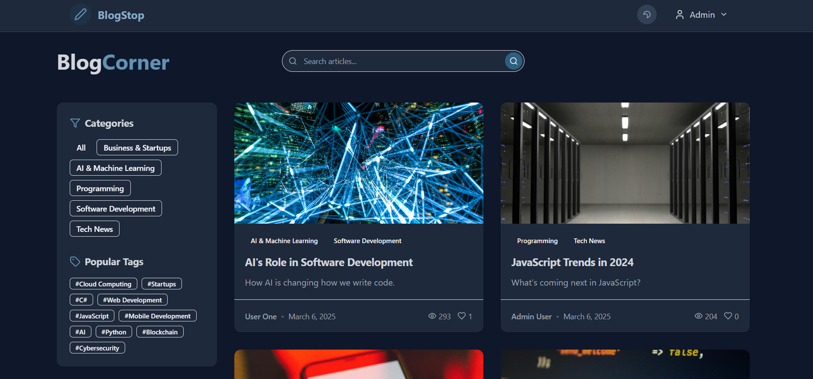
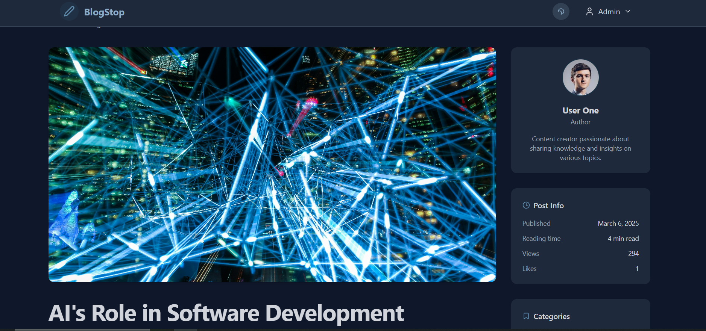

# BlogStop 📝 ## 🏗️ Overview

**BlogStop** A modern full-stack blogging platform built using .NET 6 and React 18, it is a full-featured blogging platform built using modern technologies and following clean architecture principles. The application allows users to create, edit, and manage blog posts, comments, categories, and tags. It features a responsive UI, rich text editing, user authentication, and a robust API.

The backend is built on .NET 6 with Clean Architecture patterns (Domain, Application, Infrastructure, and API layers), while the frontend utilizes React 18 with TypeScript, Redux Toolkit, and TailwindCSS for a sleek and responsive user experience.
---

<p align="center" style="display: flex; justify-content: space-between; align-items: center;">
    
    
</p>

---

## 👀 Try it out

To run the project locally:

```bash
git clone https://github.com/KristiyanEnchev/BlogStop.git
```

```bash
cd BlogStop/
```

```bash
cp .env.example .env
```

Update any required values in the .env file, then start the application with Docker:

```bash
docker-compose up -d
```

## 🔠 Configuration

- **Default Admin Account**: Email: admin@admin.com, Password: 123456
- **Database**: PostgreSQL. DB UI - `http://localhost:5050` - Acc: **admin** - Pass: **password**
- **API URL**: `http://localhost:8080`
- **UI URL**: `http://localhost:3000`

## 🔧 Built with

### Backend:

- [.NET 6](https://dotnet.microsoft.com/) - Modern web framework
- [ASP.NET Core Web API](https://docs.microsoft.com/en-us/aspnet/core/web-api) - API endpoints
- [Entity Framework Core 6](https://docs.microsoft.com/en-us/ef/core/) - ORM for data access
- [Clean Architecture](https://blog.cleancoder.com/uncle-bob/2012/08/13/the-clean-architecture.html) - Layered architecture for separation of concerns
- [Domain-Driven Design](https://martinfowler.com/bliki/DomainDrivenDesign.html) - Design approach focused on the domain model
- [CQRS & MediatR](https://github.com/jbogard/MediatR) for command/query separation
- [FluentValidation](https://github.com/FluentValidation/FluentValidation) for request validation
- [Domain Events](https://www.martinfowler.com/eaaDev/DomainEvent.html) for decoupled domain logic
- [Repository Pattern](https://martinfowler.com/eaaCatalog/repository.html) for data access abstraction
- [PostgreSQL](https://www.postgresql.org/) - Relational database
- [Swagger/OpenAPI](https://swagger.io/) - API documentation
- [JWT Authentication](https://jwt.io/) - Secure user authentication

### Frontend:

- [React 18](https://reactjs.org/) - UI library
- [Vite](https://vitejs.dev/) - Next generation frontend tooling
- [TypeScript](https://www.typescriptlang.org/) - Type-safe JavaScript
- [Redux Toolkit](https://redux-toolkit.js.org/) - State management
- [React Router 6](https://reactrouter.com/) - Client-side routing
- [TailwindCSS](https://tailwindcss.com/) - Utility-first CSS
- [shadcn/ui](https://ui.shadcn.com/) - UI component system based on Radix UI
- [TipTap](https://tiptap.dev/) - Rich text editor
- [React Hook Form](https://react-hook-form.com/) - Form handling
- [Zod](https://github.com/colinhacks/zod) - Schema validation
- [Framer Motion](https://www.framer.com/motion/) - Animations
- [Vitest](https://vitest.dev/) - Unit and integration testing

### DevOps:

- **Docker & Docker Compose** - Containerization
- **GitHub Actions** - CI/CD (assumed)

## 📚 Features

- **User Authentication**
- **Blog Post Management**
- **Categorization**
- **Interactive UI**
- **Comments System**
- **Author Profiles**
- **Admin Dashboard**
- **Performance Optimizations**

## 🏛️ Architecture

BlogStop follows Clean Architecture principles:

- **Domain Layer** - Core business entities, interfaces, and business rules
- **Application Layer** - Use cases, application services, and DTOs
- **Infrastructure Layer** - Database, external services, and repositories
- **API Layer** - Controllers, middleware, and presentation logic

The frontend follows a modular approach with:
- Feature-based organization
- Component-driven UI development
- Strong typing with TypeScript
- Global state management with Redux Toolkit

## 📝 License

This project is licensed under the MIT License - see the [LICENSE](LICENSE) file for details.

## 👨‍💻 Author

- **Your Name** - [GitHub Profile](https://github.com/KristiyanEnchev)

---

## Show your support

Give a ⭐ if you like this project!
